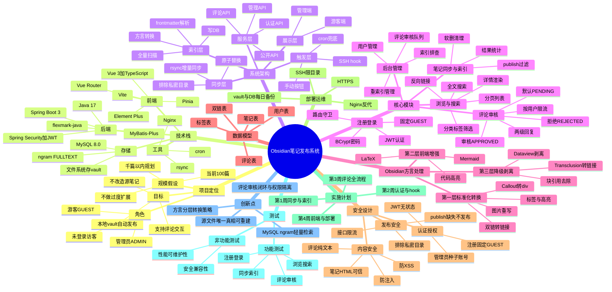

```mermaid
mindmap
  root((Obsidian笔记发布系统))
    项目定位
      目标
        本地vault自动发布
        不改造源笔记
        支持评论交互
      角色
        管理员ADMIN
        游客GUEST
        未登录访客
      规模假设
        当前100篇
        千篇以内规划
        不做过度扩展
    技术栈
      后端
        Spring Boot 3
        Java 17
        Spring Security加JWT
        MyBatis-Plus
        flexmark-java
      前端
        Vue 3加TypeScript
        Vite
        Pinia
        Vue Router
        Element Plus
      存储
        MySQL 8.0
        ngram FULLTEXT
        文件系统存vault
      工具
        rsync
        cron
        Nginx
    系统架构
      同步层
        rsync增量同步
        排除私密目录
        原子替换
      触发层
        SSH hook
        cron兜底
        手动按钮
      索引层
        全量扫描
        frontmatter解析
        方言转换
        写DB
      服务层
        公开API
        认证API
        评论API
        管理API
      展示层
        游客端
        管理端
    核心模块
      笔记同步与索引
        publish过滤
        软删清理
        结果统计
      浏览与搜索
        分类标签筛选
        分页列表
        详情渲染
        反向链接
        全文搜索
      注册登录
        固定GUEST
        BCrypt密码
        JWT认证
        路由守卫
      评论审核
        默认PENDING
        审核APPROVED
        拒绝REJECTED
        两级回复
        按用户限流
      后台管理
        重索引管理
        评论审核队列
        用户管理
        索引排查
    Obsidian方言处理
      第一层标准化转换
        双链转链接
        图片重写
        标签与高亮
        Callout转div
      第二层前端增强
        Mermaid
        LaTeX
        代码高亮
      第三层降级剥离
        Dataview剥离
        块引用去除
        Transclusion转链接
    数据模型
      笔记表
      标签表
      双链表
      用户表
      评论表
    安全设计
      认证授权
        注册固定GUEST
        管理员种子账号
        JWT无状态
      内容安全
        笔记HTML可信
        评论纯文本
        防XSS
        防注入
      发布安全
        publish缺失不发布
        排除私密目录
        接口限流
    部署运维
      Nginx反代
      HTTPS
      SSH限目录
      vault与DB每日备份
    实施计划
      第1周同步与索引
      第2周认证与hook
      第3周评论全流程
      第4周前端与部署
    测试
      功能测试
        同步索引
        浏览搜索
        注册登录
        评论审核
      非功能测试
        安全兼容性
        性能可维护性
    创新点
      方言分层转换策略
      源文件唯一真相可重建
      评论审核闭环与权限隔离
      MySQL ngram轻量检索
```