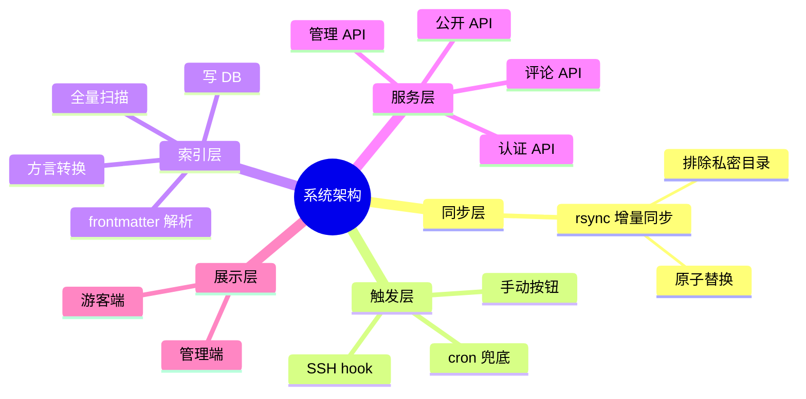

```mermaid
mindmap
  root((系统架构))
    同步层
      rsync 增量同步
        排除私密目录
        原子替换
    触发层
      SSH hook
      cron 兜底
      手动按钮
    索引层
      全量扫描
      frontmatter 解析
      方言转换
      写 DB
    服务层
      公开 API
      认证 API
      评论 API
      管理 API
    展示层
      游客端
      管理端
```

